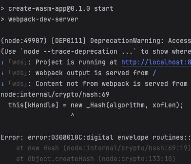

## About

An implementation of [Conway's Game of Life](https://en.wikipedia.org/wiki/Conway%27s_Game_of_Life) 
using Rust and WebAssembly.

## 🚴 Usage

### 🛠️ Build with `wasm-pack build`

```
wasm-pack build
```

### Install dependencies with `npm`

```bash
cd www && npm install
```

### Run locally

```bash
npm run start
```

### 🔬 Test in Headless Browsers with `wasm-pack test`

```
wasm-pack test --headless --firefox
```

## Known Issues
- If the error in the image below occurs when running `npm run start` on MacOS, it can be fixed by running 
  `export NODE_OPTIONS=--openssl-legacy-provider`.
  .

## 🔋 Batteries Included

* [`wasm-bindgen`](https://github.com/rustwasm/wasm-bindgen) for communicating
  between WebAssembly and JavaScript.
* [`console_error_panic_hook`](https://github.com/rustwasm/console_error_panic_hook)
  for logging panic messages to the developer console.

<div align="center">

<sub>Built with 🦀🕸 </a></sub>

</div>
