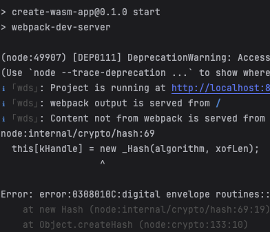

## 🚴 Usage

### Install dependencies with `npm`

```bash
npm install
```

### Start local server
``` bash
npm run start
```

## Known Issues
- If the error in the image below occurs when running `npm run start` on MacOS, it can be fixed by running
  `export NODE_OPTIONS=--openssl-legacy-provider` to fix it.
  .